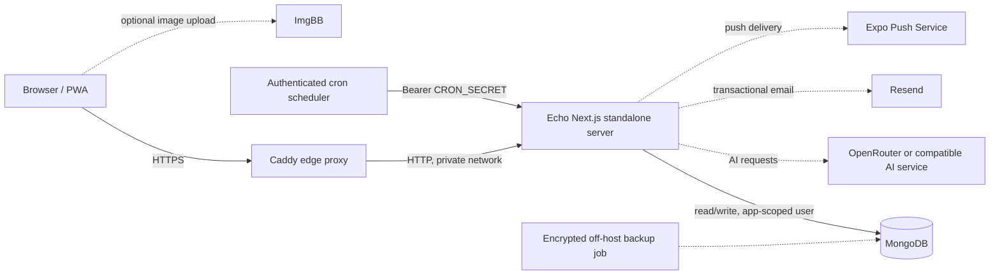

# Echo self-hosting architecture

This design removes the Vercel runtime dependency while preserving the current Next.js application model. A single Docker Compose project runs the edge proxy, application, authenticated scheduler, and MongoDB on one host.



## Deployment boundaries

- **Public:** only Caddy ports 80 and 443. Caddy obtains and renews TLS certificates when `SITE_ADDRESS` is a public domain.
- **Private Compose network:** Next.js on port 3000, MongoDB on port 27017, and the scheduler. Neither application nor database ports are published to the host.
- **Persistent state:** `mongo_data` stores all application data; `caddy_data` stores TLS state. The application and scheduler are disposable.
- **Trust:** the app receives a database user limited to `readWrite` on the `echo` database. Mongo's root account is used only for bootstrap and administration.

## Start it

Requirements: Docker Engine with Compose v2, a server with ports 80/443 reachable, and DNS pointing the chosen hostname at that server.

```bash
cp .env.selfhost.example .env
# Fill every required secret and integration key in .env.
docker compose config
docker compose up -d --build
docker compose ps
curl https://echo.example.com/api/health
```

Generate secrets with `openssl rand -hex 32`. Treat `ENCRYPTION_SECRET_KEY` as data: losing it makes encrypted journal content unrecoverable. Keep it in the backup set and do not rotate it without a data migration.

For LAN-only evaluation, set `SITE_ADDRESS=:80`, set `NEXT_PUBLIC_BASEURL` to the server's HTTP address, and access port 80. Rebuild the app after changing a `NEXT_PUBLIC_*` variable because Next.js embeds those values in the browser bundle.

## Operations

### Backups

Back up MongoDB with `mongodump --archive --gzip`, encrypt the archive, and copy it off the host. Back up `.env` separately in a secrets manager. A backup is not valid until a restore has been tested into a fresh MongoDB instance.

Recommended policy: daily database backup, 7 daily + 5 weekly + 12 monthly copies, and a quarterly restore drill. Never rely only on the Docker volume or a snapshot on the same server.

### Updates and rollback

Build immutable images in CI and deploy a pinned image tag for production. Before an update, take a database backup. Roll back by restoring the previous image tag; restore MongoDB only when a release performed an incompatible data migration.

### Monitoring

- Probe `/api/health` through Caddy for end-to-end readiness.
- Alert on container restarts, disk usage, TLS renewal failure, MongoDB health, and scheduler errors.
- Ship container logs off-host and avoid logging journal text, auth cookies, API keys, or decrypted entries.

## Current external dependencies

The stack is self-hosted at the compute and database layers, but it is not yet fully offline. The current code still calls OpenRouter (AI), Resend (email), Expo (push), Google (optional OAuth), and ImgBB (optional uploads). For a dependency-free deployment, add provider adapters before substituting:

- an OpenAI-compatible local inference endpoint such as vLLM or Ollama for OpenRouter (configure `AI_BASE_URL`, `AI_MODEL`, and optionally `AI_API_KEY`);
- SMTP for Resend;
- S3-compatible object storage such as MinIO for ImgBB;
- local password auth only, or an OIDC provider such as Authentik/Keycloak, for Google OAuth.

Expo push delivery cannot be fully self-hosted for the existing mobile push-token flow; web push can be delivered directly with VAPID, while native Apple/Google push ultimately uses APNs/FCM.

## Scaling path

Start with one application replica. Mongo-backed sessions and rate limits already support multiple replicas, but scheduled notification routes are not uniformly idempotent. Before horizontal scaling, add job leases/idempotency keys and move scheduled work into a durable queue. At that point, run multiple stateless app replicas behind Caddy and a MongoDB replica set on separate failure domains.
